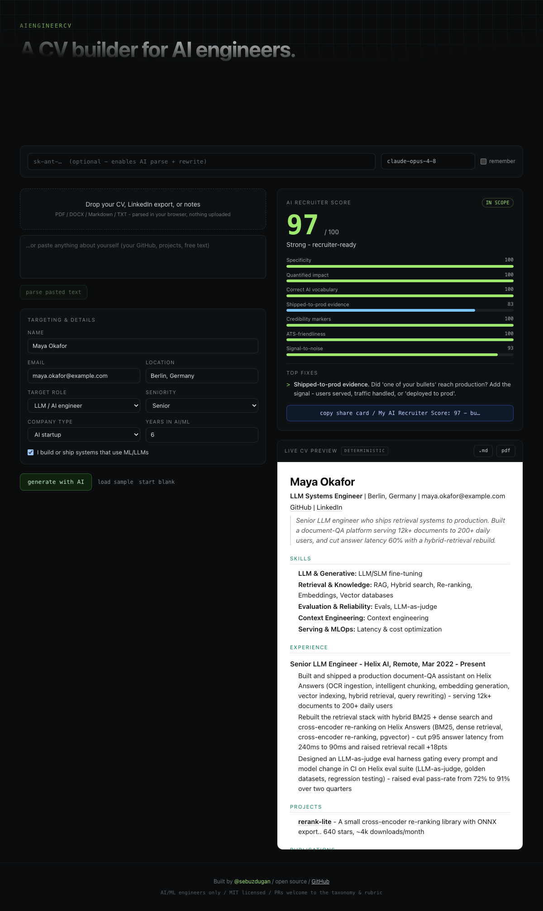

<!-- This README is a stub. It becomes the landing page in Phase 5. -->

# AIEngineerCV

> An open-source CV builder for **AI engineers**. One brain, three doors.

[](LICENSE)
[](https://github.com/sebuzdugan/AIEngineerCV/stargazers)
[](https://github.com/sebuzdugan/AIEngineerCV/pulls)
[](https://sebuzdugan.github.io/AIEngineerCV/)

**[Try it in your browser](https://sebuzdugan.github.io/AIEngineerCV/)** - no signup, no upload.

Turn your raw materials - an old CV, a LinkedIn export, a GitHub, or just free text - into a
polished, role-targeted CV, by applying baked-in **AI-engineering hiring judgment** instead of
generic resume tips.

[](https://sebuzdugan.github.io/AIEngineerCV/)

- **One canonical `Profile`** - a validated schema that fully describes a candidate.
- **Three thin adapters** - Web (drag-and-drop), CLI (`npx`/`aicv`), and a Claude plugin - that
  each do one job: populate a valid `Profile`.
- **One generation spec** - the deterministic, prompt-driven brain that turns a `Profile` into a CV.

**Bring your own key.** Calls go directly from your machine to your model provider. We never
proxy, store, or see your key or your data. No backend, no database, no telemetry.

## CLI (`aicv`)

The CLI wraps the shared brain end to end: ingest your materials, answer only the gap questions,
generate, score, export.

```bash
# from a clone of this repo
pnpm install && pnpm build

export ANTHROPIC_API_KEY=sk-ant-...   # optional: enables the LLM parse + rewrite

aicv init                 # interactive interview, writes profile.json
aicv ingest my-cv.pdf     # parse a CV / LinkedIn export / notes into profile.json
aicv generate             # build ./out/cv.md (LLM rewrite if a key is set, else deterministic)
aicv score                # AI Recruiter Score + guardrail + top-3 fixes
aicv export --md --html   # write ./out/cv.md and a print-ready ./out/cv.html (Print -> PDF)
```

Every LLM step is optional. With no key, `aicv` still scores you, renders a clean CV
deterministically, and exports it - the score never needs a key. The guardrail (`aicv generate`)
declines out-of-scope CVs unless you pass `--force`, and never bypasses silently.

## Claude plugin

Install it as a one-line Claude Code plugin, then run `/cv` (or say "build my AI engineer CV"):

```
/plugin marketplace add sebuzdugan/AIEngineerCV
/plugin install aiengineercv@aiengineercv
```

The [`claude-skill/`](claude-skill) plugin bundles a `/cv` slash command and the **aiengineer-cv**
skill, which runs the same flow as the CLI: ingest -> draft `Profile` -> ask only the gaps ->
guardrail -> generate -> score -> write the CV to a file (and a print-ready `cv.html`; for PDF it
shells out to the CLI in Claude Code, or print/web elsewhere).
[`SKILL.md`](claude-skill/skills/aiengineer-cv/SKILL.md) points at the same six expertise assets that
power every adapter - the most direct expression of "it works as a spec in Claude."

## Web app

The [live drag-and-drop app](https://sebuzdugan.github.io/AIEngineerCV/) ([`apps/web`](apps/web))
runs the same brain in your browser: drop a CV or paste your background, see the live editable CV
preview and a screenshot-worthy AI Recruiter Score, copy the share-card, and export to Markdown or
PDF - all client-side. Bring your own key (optional) for the AI parse and rewrite; the score and the
deterministic CV need no key. It's a Vite + React static build deployed free to GitHub Pages with
zero server cost.

🚧 **Status:** all four adapters are built - core brain, CLI, Claude plugin, and web app. See
[`docs/superpowers/specs`](docs/superpowers/specs) for the design, [`packages/core`](packages/core)
for the assets that make the tool good, [`apps/cli`](apps/cli) for the CLI,
[`claude-skill`](claude-skill) for the Claude plugin, and [`apps/web`](apps/web) for the web app.

## Built by @sebuzdugan

An AI engineer, for AI engineers. Say hi or follow along:

[](https://x.com/sebuzdugan)
[](https://youtube.com/@sebuzdugan)
[](https://medium.com/@sebuzdugan)
[](https://github.com/sebuzdugan)

MIT licensed. PRs welcome - especially to the
[taxonomy](packages/core/assets/taxonomy.yaml) and [rubric](packages/core/assets/rubric.yaml);
every contribution to the AI-engineering vocabulary makes the tool sharper.
